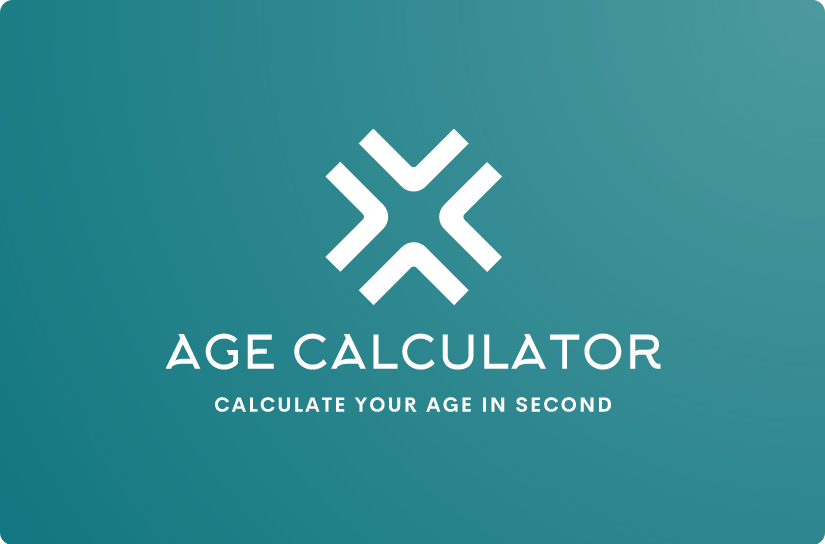
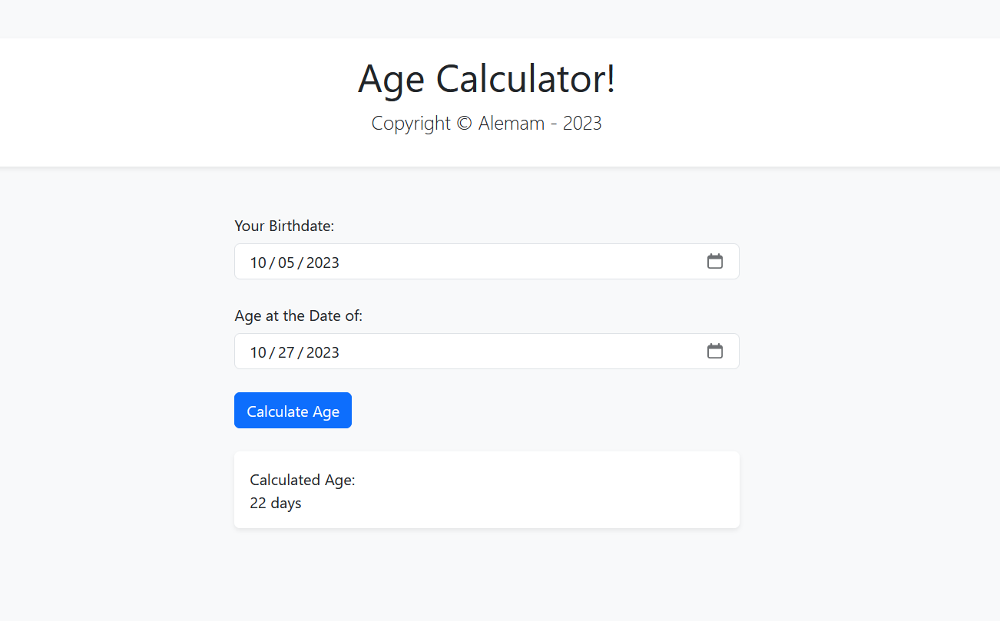

 

  

  <h3 align="center">Age Calculator</h3>

  

     
     
    <a href="https://www.canva.com/design/DAFyZUcVcGk/1QwrhbqVbTHup8uoq4WQow/watch?utm_content=DAFyZUcVcGk&utm_campaign=designshare&utm_medium=link&utm_source=editor">View Demo</a>
    .
    <a href="https://bit.ly/3Sg3C2x">Visit My Application</a>
    .
    <a href="https://github.com/alemam242/Age-Calculator/issues">Report Bug</a>
  

    

## About The Project

The Age Calculator Web Application is a user-friendly tool designed to help individuals quickly determine their age based on their birthdate and another specified date. Whether you're curious about your age in years, months, and days, or you need to calculate someone else's age, this application provides a simple and intuitive interface to perform accurate age calculations.

Features:

* User-Friendly Interface: The application offers a clean and intuitive user interface, making it easy for users of all ages to input their birthdate and another date for age calculation.

* Precise Age Calculation: The Age Calculator calculates age in years, months, and days, providing users with detailed and accurate results.

* Educational Tool: Ideal for students learning about date and time calculations, the Age Calculator serves as an educational resource to understand the concept of age and date differences.

* Useful for Various Scenarios: Whether it's for personal curiosity, educational purposes, or professional applications that require age verification, this tool is versatile and applicable in different contexts.

Who Is It For?

* Students: Students can use this application to enhance their understanding of date calculations and practice age-related computations in a real-world context.

* Individuals: Anyone curious about their exact age or wanting to calculate the age of others, be it family, friends, or colleagues, can use this tool conveniently.

* Educators: Teachers and educators can incorporate this tool into their lessons to demonstrate practical applications of date calculations and engage students in interactive learning experiences.

* Developers: Developers interested in exploring interactive web applications or practicing their front-end and back-end development skills can use this project as a learning resource.

* General Public: Anyone interested in a simple, user-friendly Age Calculator for personal use can access this application online.

This Age Calculator Web Application serves as a valuable educational and practical tool, offering accurate age calculations with a user-friendly interface. Whether you're a student, educator, developer, or an individual curious about your age, this application provides an effortless way to calculate and understand age differences.

## Built With

HTML, CSS, BOOTSTRAP, JAVASCRIPT, PHP

## Contributing

Contributions are what make the open source community such an amazing place to be learn, inspire, and create. Any contributions you make are **greatly appreciated**.
* If you have suggestions for adding or removing projects, feel free to [open an issue](https://github.com/alemam242/Age-Calculator/issues/new) to discuss it, or directly create a pull request after you edit the *README.md* file with necessary changes.
* Please make sure you check your spelling and grammar.

### Creating A Pull Request

1. Fork the Project
2. Create your Feature Branch (`git checkout -b feature/AmazingFeature`)
3. Commit your Changes (`git commit -m 'Add some AmazingFeature'`)
4. Push to the Branch (`git push origin feature/AmazingFeature`)
5. Open a Pull Request

## Authors

* **Al Emam** - *Android App Developer | Web Developer* - [Al Emam](https://github.com/alemam242/)

## Badges

## Support

For support, email alemam242@gmail.com.

